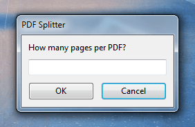

# AHK-Utils

This repository contains various AHK classes and functions I find useful.

## [GuiPrompt.ahk](Lib/GuiPrompt.ahk)

Creates a basic, self-contained prompt. A prettier alternative to the native `InputBox`.

API

```ahk
prompt := new GuiPrompt({ promptTitle: "PDF Splitter" })
prompt.AddInput({ textLabel: "How many pages per PDF?"
  , variable: "amountInput" })

inputResult := prompt.Show()

if (inputResult) {
  msgBox % inputResult["amountInput"]
} else {
  msgBox % "User canceled"
}
```

Result


